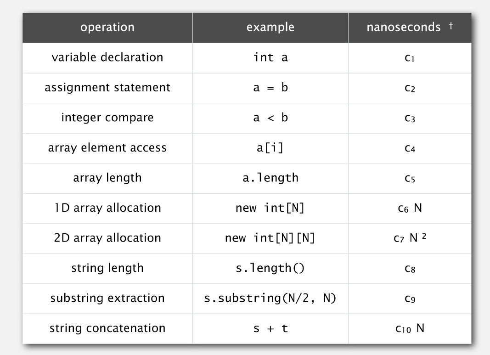
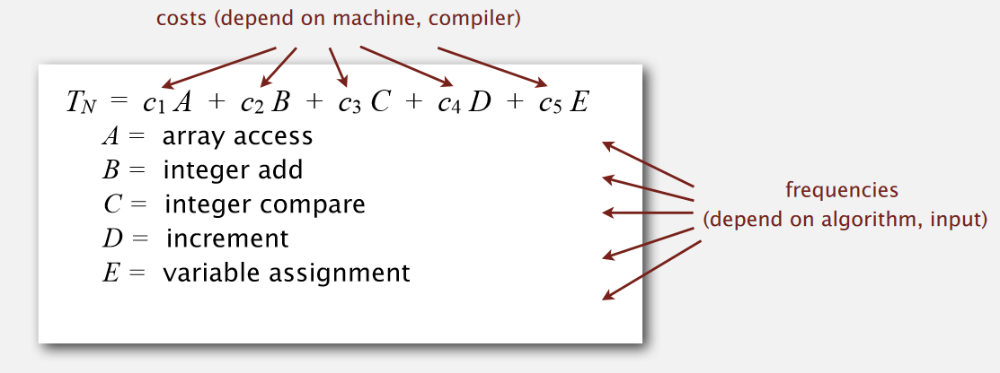
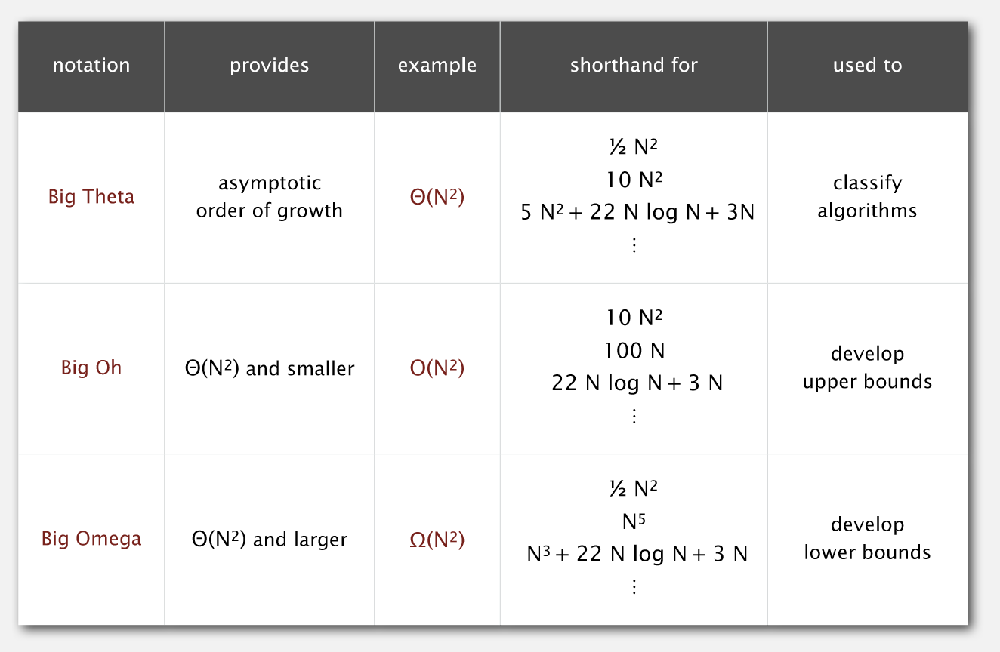

# estimate
## estimate methods
1. take discrete course
2. replace the sum with an integral, and use calculus.
    - Ex1: $1 + 2 + 3 + ...+ N$,
        $\displaystyle \sum_{i = 1}^{N} i = \int_1^N x dx \sim \frac{1}{2} N^2$
    - Ex2 : $1^k + 2^k+ ... + N^k$
        $\displaystyle \sum_{i = 1}^{N} i^k = \int_1^N x^k dx \sim \frac{1}{k+1} N^{k+1}$
    - Ex3 : $ 1 + 1/2 + 1/3 + ... + 1/ N$
        $\displaystyle \sum_{i = 1}^{N} 1/i = \int_1^N 1/xdx \sim \ln x$
    - Ex4 (tri-sum) : $ \displaystyle \sum_{i = 1}^{N} \sum_{i = x}^{N} \sum_{i = y}^ {N}1 = \int_1^N \int_{y = x}^N \int_{z = y}^N \sim \frac{1}{6} N^3$
    
## costs of basic operations

## mathematical modules for running time

## notions and their usage scenarios

+ Big Theta Notion is used to most of algorithms(in other words, it provides an average cost estimation)
+ Big Oh is used to find the **upper bounds** costs
+ Big Omega is used to find the **lower bounds** costs

**upper bound:** a specific case of algorithm
**lower bound:** to proof that no other case of algorithms can do better.

## memory usage summary
1. 4bytes for int, 8 bytes for double, ...
2. Object reference 8 bytes(depends on program language and operations)
3. others ...
4. padding: round up to multiple of 8 bytes
